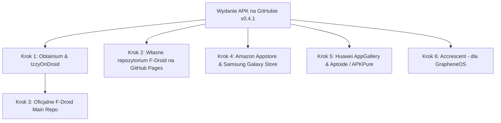

# 📱 Kompletny Przewodnik Dystrybucji: Alternatywne Sklepy z Aplikacjami dla Hyperreal Journal

Przewodnik wdrożeniowy i instrukcje krok po kroku dotyczące publikacji aplikacji **Hyperreal Journal** w niezależnych, alternatywnych sklepach z aplikacjami na system Android (poza Google Play Store).

---

## 🎯 Profil Aplikacji pod kątem Wymogów Sklepów

| Cecha | Stan w projekcie | Wpływ na akceptację w sklepach |
|---|---|---|
| **Licencja & Kod** | Open Source (GPL / Apache 2.0 / MIT) | Wymóg bezwzględny dla F-Droid / IzzyOnDroid |
| **Prywatność** | 100% Offline, 0 trackerów, brak analityki | Ogromna zaleta (IzzyOnDroid, F-Droid, Accrescent) |
| **Zależności** | Brak Google Mobile Services (GMS) | Może działać na Huawei AppGallery, Fire OS, GrapheneOS |
| **Tematyka** | Harm Reduction / Dziennik / Edukacja | Wymaga odpowiedniego pozycjonowania (Wellness / Health) |

---

## 🏆 Ranking i Priorytety Dystrybucji



---

## 1. IzzyOnDroid (F-Droid Third-Party Repo) ⭐ Rekomendowany Krok 1

**Zasięg:** Ponad 500 000 świadomych użytkowników korzystających z aplikacji F-Droid, Neo Store czy Droid-ify.  
**Koszt:** 0 PLN (darmowy).  
**Czas weryfikacji:** 1–3 dni robocze (prowadzony przez kuratora Izzy).

### Dlaczego to najlepszy start?
IzzyOnDroid pobiera gotowy plik `.apk` bezpośrednio z **GitHub Releases** (nie kompiluje samemu ze źródeł, jak oficjalny F-Droid), a aktualizacje trafiają do użytkowników w ciągu kilkunastu minut od publikacji nowego wydania na GitHubie!

### Instrukcja zgłoszenia krok po kroku:
1. Wejdź do repozytorium zgłoszeń IzzyOnDroid na GitLabie:  
   👉 [GitLab: IzzyOnDroid / Repo Requests](https://gitlab.com/IzzyOnDroid/repo/-/issues)
2. Kliknij **New issue**.
3. Wybierz szablon zgłoszenia: **`Submit an application`**.
4. Wypełnij formularz danymi Hyperreal Journal:
   - **App Name:** Hyperreal Journal
   - **Repository URL:** `https://github.com/merx666/hyperreal-journal`
   - **License:** Open Source (wskaż plik LICENSE w repozytorium)
   - **Release Binary:** Wskaż URL do ostatniego wydania (`https://github.com/merx666/hyperreal-journal/releases/latest`)
   - **Tag format:** `v%v` (np. `v0.4.1`)
   - **Trackers:** 0 (aplikacja jest czysta od analityki)
   - **Short Description:** *Privacy-first offline harm reduction journal and substance timeline tracker.*
5. Wyślij zgłoszenie. Kurator sprawdzi plik APK pod kątem antywirusów i braku trackerów (Exodus Privacy) i włączy bota automatycznie pobierającego kolejne wydania.

---

## 2. Obtainium (Agregator Aktualizacji z GitHuba) ⭐ Działa Natychmiast

**Zasięg:** Zaawansowani użytkownicy Androida, entuzjaści prywatności i bezpieczeństwa (GrapheneOS, CalyxOS, LineageOS).  
**Koszt:** 0 PLN.  
**Czas weryfikacji:** 0 minut (aplikacja jest już gotowa!).

### Jak użytkownicy instalują aplikację przez Obtainium?
Obtainium to aplikacja open-source na telefon, która działa jak sklep instalujący i aktualizujący programy bezpośrednio z GitHub Releases.

### Instrukcja dla użytkowników:
1. Pobierz [Obtainium z GitHuba](https://github.com/ImranR98/Obtainium).
2. Otwórz Obtainium i kliknij **Add App**.
3. Wklej URL repozytorium: `https://github.com/merx666/hyperreal-journal`.
4. Kliknij **Add**.
5. Obtainium automatycznie pobierze najnowszy plik `hyperreal_journal_v0.4.1.apk`, zainstaluje go i powiadomi o kolejnych wydaniach.

---

## 3. Oficjalne F-Droid Main Repository

**Zasięg:** Ponad 2 miliony użytkowników ekosystemu wolnego oprogramowania.  
**Koszt:** 0 PLN.  
**Czas weryfikacji:** 2–6 tygodni (kompilacja z oficjalnych serwerów F-Droid).

### Wymagania:
- Kod w 100% open-source.
- Kompilacja ze źródeł musi być w 100% powtarzalna bez pobierania prekompilowanych plików binarnych `.jar` / `.so` spoza dozwolonych repozytoriów Mavena.
- Brak zamkniętych bibliotek (Google Play Services, proprietary analytics). Hyperreal Journal spełnia ten warunek!

### Instrukcja zgłoszenia krok po kroku:
1. Sforkuj repozytorium metadanych F-Droid:  
   👉 [https://gitlab.com/fdroid/fdroiddata](https://gitlab.com/fdroid/fdroiddata)
2. Utwórz nowy plik w katalogu `metadata/info.hyperreal.journal.yml`:
   ```yaml
   Categories:
     - Health & Fitness
   License: Apache-2.0 # lub Twoja licencja
   SourceCode: https://github.com/merx666/hyperreal-journal
   IssueTracker: https://github.com/merx666/hyperreal-journal/issues
   Summary: Offline harm reduction journal & bio-telemetry tracker
   Description: |-
     Hyperreal Journal is a privacy-first, offline harm-reduction and substance
     tracking tool designed to help users monitor durations, doses, and interactions safely.

   RepoType: git
   Repo: https://github.com/merx666/hyperreal-journal.git

   Builds:
     - versionName: 0.4.1
       versionCode: 2
       commit: v0.4.1
       subdir: app
       gradle:
         - yes

   AutoUpdateMode: Version v%v
   UpdateCheckMode: Tags
   CurrentVersion: 0.4.1
   CurrentVersionCode: 2
   ```
3. Otwórz Merge Request do głównego repozytorium `fdroiddata`.
4. Bot F-Droid (`fdroid build`) przetestuje kompilację. Po zatwierdzeniu przez społeczność aplikacja znajdzie się w głównym katalogu F-Droid.

---

## 4. Własne Repozytorium F-Droid na GitHub Pages (Hyperreal F-Droid Repo)

Można uruchomić własny dedykowany kanał dystrybucji z adresem `https://merx666.github.io/fdroid/repo/`. Użytkownik dodaje ten adres w ustawieniach F-Droida lub skanuje kod QR i ma automatyczne aktualizacje bezpośrednio z naszych serwerów!

### Narzędzie:
- Użycie oficjalnego narzędzia [fdroidserver](https://f-droid.org/docs/Setup_an_F-Droid_App_Repo/) w GitHub Actions.
- Każdy commit z tagiem `v*` automatycznie aktualizuje `index.xml` i podpisuje repozytorium kluczem PGP.

---

## 5. Amazon Appstore

**Zasięg:** Ponad 50 milionów urządzeń (tablety Amazon Fire, telewizory Fire TV, smartfony z Androidem, integracja z Windows 11).  
**Koszt:** 0 PLN (darmowe konto Amazon Developer).  
**Czas weryfikacji:** 24–72 godziny.

### Dlaczego warto?
Amazon nie posiada restrykcyjnych polityk dotyczących aplikacji redukcji szkód tak jak Google Play, o ile aplikacja jest sklasyfikowana jako narzędzie edukacyjne / zdrowotne i zawiera odpowiedni disclaimer. Ponadto tablety Fire OS nie mają usług Google, a Hyperreal Journal działa offline bez żadnych zależności GMS!

### Instrukcja publikacji:
1. Zarejestruj darmowe konto: [Amazon Developer Console](https://developer.amazon.com/apps-and-games).
2. Przejdź do **App List** ➔ **Add New App** ➔ **Android**.
3. Podaj dane:
   - **App Title:** Hyperreal Journal
   - **App Category:** Health & Fitness ➔ Personal Wellness / Lifestyle
   - **Default Language:** Polish / English
4. Wgraj plik `hyperreal_journal_v0.4.1.apk`.
5. Dodaj zrzuty ekranu i ikony (Amazon wymaga ikon 512x512 oraz min. 3 zrzutów ekranu w jakości HD).
6. Uzupełnij deklarację prywatności (zaznacz: *No data collection, completely offline*).
7. Kliknij **Submit App**.

---

## 6. Samsung Galaxy Store

**Zasięg:** Setki milionów smartfonów i tabletów marki Samsung na całym świecie. Drugi co do wielkości sklep natywny na Androidzie.  
**Koszt:** 0 PLN (darmowe konto Samsung Developer).  
**Czas weryfikacji:** 2–5 dni roboczych.

### Instrukcja publikacji:
1. Zarejestruj się w [Samsung Developer Portal](https://developer.samsung.com/galaxy-store).
2. Zaloguj się do **Galaxy Store Developer Console** (GSPC).
3. Kliknij **Add New Application** ➔ **Android**.
4. Wgraj plik `.apk`.
5. Wypełnij pola metadanych:
   - Kategoria: *Zdrowie i fitness* (lub *Narzędzia medyczne / Styl życia*).
   - Ograniczenia wiekowe: Wskaż 18+ (ze względu na tematykę substancji psychoaktywnych).
   - Treść: Używaj sformułowań: *Edukacyjny dziennik osobisty, redukcja szkód, prewencja interakcji medycznych*.
6. Prześlij aplikację do recenzji.

---

## 7. Huawei AppGallery

**Zasięg:** Dominujący sklep w ekosystemie Huawei (ponad 580 milionów aktywnych użytkowników miesięcznie), popularny na rynkach bez dostępu do usług Google.  
**Koszt:** 0 PLN (wymaga weryfikacji tożsamości dewelopera).  
**Czas weryfikacji:** 1–3 dni robocze.

### Specyfika:
Hyperreal Journal nie korzysta z Google Play Services, co czyni go w 100% kompatybilnym z urządzeniami Huawei (HarmonyOS / EMUI) bez jakichkolwiek modyfikacji kodu.

### Instrukcja publikacji:
1. Załóż konto na [HUAWEI Developers](https://developer.huawei.com/consumer/en/).
2. Przejdź do konsoli **AppGallery Connect** ➔ **My Apps** ➔ **New App**.
3. Wybierz typ: *APK*, kategoria: *Health & Fitness*.
4. Wgraj pakiet instalacyjny `hyperreal_journal_v0.4.1.apk`.
5. Prześlij do weryfikacji.

---

## 8. Aptoide & APKPure

**Zasięg:** Alternatywne platformy globalne (ponad 300 milionów użytkowników łącznie).  
**Koszt:** 0 PLN.  
**Czas weryfikacji:** Od kilkunastu minut do 24h.

### Aptoide:
- Wejdź na [Aptoide Developers](https://en.aptoide.com/developers).
- Utwórz darmowy profil sklepu (np. `hyperreal-journal.store.aptoide.com`).
- Wgraj plik APK lub podłącz kanał RSS z GitHuba, który automatycznie importuje wydania.

### APKPure:
- Zaloguj się w [APKPure Developer Console](https://developer.apkpure.com/).
- Zgłoś aplikację przez formularz bezpośredniego wgrania pliku `.apk`.

---

## 9. Accrescent (Next-Gen Private Android App Store)

**Zasięg:** Użytkownicy systemów nastawionych na wysokie bezpieczeństwo (GrapheneOS).  
**Koszt:** 0 PLN.  
**Wymagania:** Nowoczesny format, podpis APK v2/v3, zero trackerów.

### Dlaczego warto?
Accrescent staje się preferowanym sklepem dla użytkowników GrapheneOS, którzy szukają bezpiecznych, zweryfikowanych kryptograficznie aplikacji bez powiązania z kontami Google.

### Zgłoszenie:
- Przewodnik deweloperski: [Accrescent Submissions](https://accrescent.app/docs/developers).
- Wymaga zgłoszenia pakietu podpisanego kluczem deweloperskim i weryfikacji sygnatury.

---

## 📋 Strategia Opisów i Akceptacji (Harm Reduction vs Cenzura)

Podczas zgłaszania aplikacji do sklepów komercyjnych (Amazon, Samsung, Huawei) kluczowe jest **odpowiednie nazewnictwo**, aby uniknąć automatycznych filtrów słów kluczowych związanych z narkotykami:

| ❌ Unikaj w opisach głównych | ✅ Używaj zamienników |
|---|---|
| "Dziennik narkotykowy / dragi" | "Dziennik substancji / farmakokinetyka" |
| "Narkotyki, ćpanie, high" | "Śledzenie faz działania, redukcja szkód" |
| "Baza używek" | "Encyklopedia substancji i interakcji fizjologicznych" |
| "Kalkulator faz fazowania" | "Kalkulator parametrów farmakokinetycznych i dawek" |

### Gotowy wzór opisu do formularzy zgłoszeniowych:
> **PL:** *Hyperreal Journal to nowoczesne, w pełni bezpieczne i działające lokalnie (offline) narzędzie do monitorowania samopoczucia, dawek oraz faz działania substancji. Aplikacja powstała w oparciu o zasady redukcji szkód (harm reduction), oferując kalkulator interakcji, wykresy farmakokinetyczne w czasie rzeczywistym oraz inteligentne przypomnienia o nawodnieniu i odpoczynku. Aplikacja nie zbiera żadnych danych osobowych.*
>
> **EN:** *Hyperreal Journal is a privacy-first, offline wellness and harm-reduction journaling application. It empowers users with real-time pharmacokinetic timeline visualizations, physiological interaction warnings, and smart hydration reminders. 100% offline, zero data collection, no telemetry.*

---

## 🚀 Plan Działania na Najbliższe Dni

1. **Dziś (Natychmiast):**
   - Dodać instrukcję dla **Obtainium** w `README.md` (użytkownicy mogą instalować v0.4.1 od zaraz).
   - Założyć zgłoszenie w **GitLab IzzyOnDroid** (zajmuje 5 minut).
2. **W tym tygodniu:**
   - Założyć darmowe konto na **Amazon Developer** i wrzucić plik v0.4.1.
   - Założyć konto na **Aptoide** i utworzyć dedykowane repozytorium.
3. **W kolejnym kroku:**
   - Przygotować zgłoszenie Merge Request do głównego katalogu **F-Droid**.
