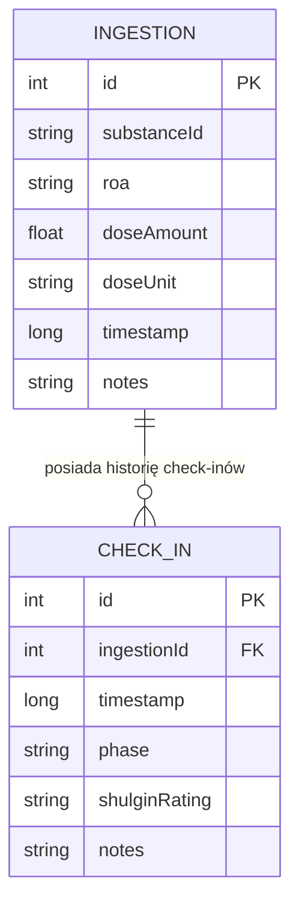

# Interaktywne Check-iny podczas Sesji i Skala Shulgina (Live Session Timeline & Shulgin Rating) - Specyfikacja Projektowa

Data utworzenia: 2026-09-18  
Status: Zatwierdzony do implementacji  
Projekt: Hyperreal Journal (Android, Kotlin, Jetpack Compose, Room, Hilt, MVI)

---

## 1. Cel i Kontekst Biznesowy (Harm Reduction)

Podczas trwania sesji substancji psychoaktywnej (psychodeliki, dysocjanty, stymulanty, kannabinoidy, itp.) percepcja czasu oraz intensywności działania ulega zniekształceniu. Psychonauci i badacze na całym świecie (m.in. Alexander Shulgin, Erowid, MAPS) stosują wystandaryzowaną metodę notowania przebiegu doświadczenia poprzez **check-iny w czasie rzeczywistym** oraz **Skalę Oceny Shulgina (Shulgin Rating Scale)**.

W obecnej wersji *Hyperreal Journal* aplikacja posiada silnik farmakokinetyki (`TimelineCalculator`), który szacuje fazy (`ONSET`, `COMEUP`, `PEAK`, `OFFSET`, `AFTERGLOW`, `BASELINE`) i odlicza czas w karcie aktywnej sesji na ekranie `JournalScreen`. Brakuje jednak możliwości:
1. Rejestrowania subiektywnych punktów kontrolnych (check-inów) w trakcie trwania sesji z przypisaniem do wyliczonej fazy.
2. Oceny głębokości i intensywności stanu w skali Shulgina (`±`, `+`, `++`, `+++`, `++++`).
3. Zapisywania szybkich notatek z myśli, doznań somatycznych lub wizualnych.
4. Wizualizacji przebiegu sesji w postaci chronologicznej osi czasu na karcie wpisu.

Celem niniejszego modułu jest wdrożenie relacyjnej bazy check-inów w Room (z migracją 1 $\to$ 2), interaktywnego arkusza `CheckInBottomSheet` w Compose oraz osi czasu w widoku Dziennika.

---

## 2. Skala Oceny Shulgina (Shulgin Rating Scale)

W przeciwieństwie do tradycyjnych liniowych skal 1-5, skala opracowana przez dr. Alexandra Shulgina uwzględnia jakościowe zmiany świadomości:

| Stopień | Symbol | Nazwa | Opis i Kryteria Harm Reduction |
|:---|:---:|:---|:---|
| **Stan progowy** | `±` | *Plus/Minus* | Subtelny alert, początek działania na granicy percepcji. Użytkownik nie jest pewien, czy substancja już działa. |
| **Plus Jeden** | `+` | *Plus One* | Bezdyskusyjny, wyraźny wpływ substancji, który jednak można całkowicie zignorować lub stłumić siłą woli. |
| **Plus Dwa** | `++` | *Plus Two* | Wyraźna modulacja zmysłów i toku myślenia. Użytkownik zachowuje pełną kontrolę, jest w stanie rozmawiać i odbierać telefon. |
| **Plus Trzy** | `+++` | *Plus Three* | Maksymalna intensywność farmakologiczna. Całkowite zaabsorbowanie uwagą i zmysłami, trudność w codziennym funkcjonowaniu. |
| **Plus Cztery** | `++++` | *Plus Four* | Rzadkie, mistyczne / transcendentalne doświadczenie unifikacji, oświecenia lub OOBE (niezależne od wielkości dawki). |

---

## 3. Architektura Danych i Relacji w Room



### 3.1. Encja Room (`CheckInEntity.kt`)
- Tabela: `check_ins`.
- Klucz obcy (`ForeignKey`): `parentColumns = ["id"]`, `childColumns = ["ingestionId"]`, `onDelete = CASCADE`.
- Indeks na `ingestionId`.

### 3.2. Bezpieczna Migracja Bazy Danych (`AppDatabase.kt`)
- `version = 2`.
- Migracja `MIGRATION_1_2`:
  ```sql
  CREATE TABLE IF NOT EXISTS check_ins (
      id INTEGER PRIMARY KEY AUTOINCREMENT NOT NULL,
      ingestionId INTEGER NOT NULL,
      timestamp INTEGER NOT NULL,
      phase TEXT NOT NULL,
      shulginRating TEXT NOT NULL,
      notes TEXT,
      FOREIGN KEY(ingestionId) REFERENCES ingestions(id) ON DELETE CASCADE
  );
  CREATE INDEX IF NOT EXISTS index_check_ins_ingestionId ON check_ins(ingestionId);
  ```
- W `DatabaseModule.kt`: `.addMigrations(AppDatabase.MIGRATION_1_2)`.

### 3.3. Modele Domenowe (`domain/model/CheckIn.kt`)
- `enum class ShulginRating` z symbolami, etykietami i opisami.
- `data class CheckIn(...)`.
- Interfejs `CheckInRepository` z metodami:
  - `insertCheckIn(checkIn: CheckIn): Long`
  - `deleteCheckIn(id: Long)`
  - `getCheckInsForIngestion(ingestionId: Long): Flow<List<CheckIn>>`

---

## 4. Interfejs Użytkownika (Jetpack Compose)

### 4.1. Karta Aktywnej Sesji (`JournalScreen.kt`)
- W karcie trwającej sesji (gdzie wyświetlany jest licznik odliczający do kolejnej fazy) dodajemy wyrazisty przycisk:
  - **„Zrób Check-in (Skala Shulgina)”** z ikoną notatnika/gwiazdki.
- Po kliknięciu: otwiera się `CheckInBottomSheet`.

### 4.2. Arkusz Dolny `CheckInBottomSheet`
1. **Nagłówek:** Nazwa substancji, czas od zażycia ($T+01:45$), automatycznie rozpoznana faza (np. `PEAK`).
2. **Wybór Fazy:** Rząd chipów (Onset, Comeup, Peak, Offset, Afterglow), z domyślnie zaznaczoną fazą z `TimelineCalculator` i opcją ręcznej zmiany.
3. **Kafle Skali Shulgina:** 5 kafelków z symbolami `±`, `+`, `++`, `+++`, `++++` z podświetleniem wybranego stopnia i dynamicznym objaśnieniem harm reduction.
4. **Pole tekstowe:** Notatka o doznaniach (opcjonalna, z autofocusem).
5. **Przycisk Zapisz:** Dodaje wpis do bazy i odświeża listę.

### 4.3. Prezentacja Check-inów na Karcie Wpisu w Dzienniku
- Na karcie wpisu (zarówno w trakcie sesji, jak i po jej zakończeniu):
- Sekcja z osią czasu (oś pionowa lub kropki z liniami):
  - Znacznik czasu ($T+hh:mm$),
  - Etykieta fazy i badge Shulgina z kolorem intensywności,
  - Notatka użytkownika (jeśli została wpisana),
  - Opcja usunięcia pojedynczego check-inu.

---

## 5. Przypadki Brzegowe i Testy (TDD)
1. **Sesja wielosubstancyjna (Mix):** Check-in może być przypisany do konkretnej substancji z miksu lub do głównego wpisu.
2. **Usunięcie wpisu Ingestion:** Kaskadowe usunięcie powiązanych check-inów (`ON DELETE CASCADE`).
3. **Pusty wpis notatki:** Check-in jest zapisywany poprawnie z samą oceną Shulgina i fazą.
4. **Weryfikacja bazy danych:**
   - Test migracji SQLite 1 $\to$ 2.
   - Wszystkie dotychczasowe 75 testów jednostkowych muszą przejść na zielono.
