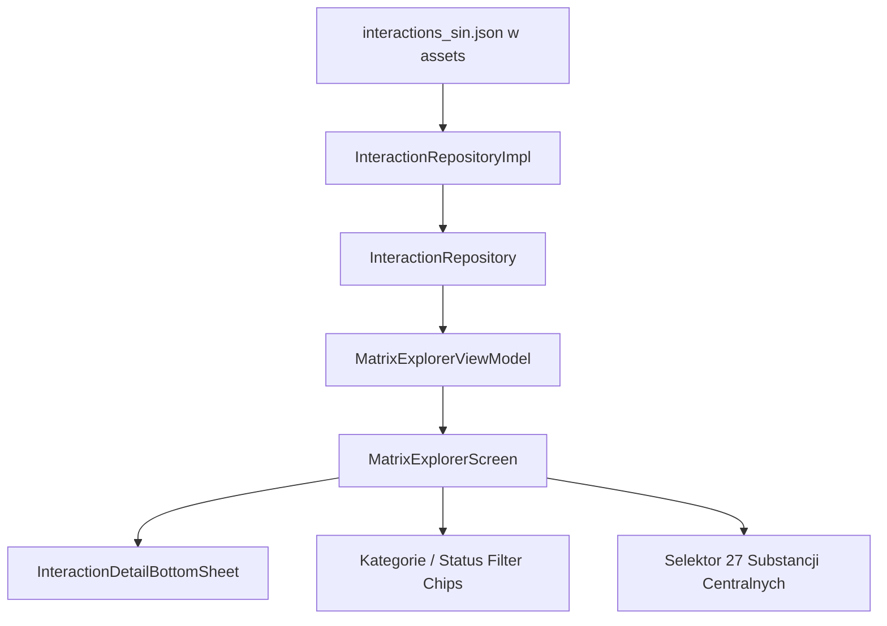

# Pełna Interaktywna Macierz Interakcji SIN (Matrix Explorer) — Specyfikacja Projektowa

Data utworzenia: 2026-09-18  
Status: Do zatwierdzenia / Przygotowany do implementacji  
Projekt: Hyperreal Journal (Android, Kotlin, Jetpack Compose, Clean Architecture, Hilt, offline-first)

---

## 1. Cel i Uzasadnienie Harm Reduction

Połączenia substancji psychoaktywnych (tzw. miksy lub politoksykomania) odpowiadają za ponad 85% zgonów i hospitalizacji związanych z przedawkowaniem substancji psychoaktywnych. Społeczna Inicjatywa Narkopolityki (SIN) we współpracy z międzynarodowym projektem TripSit opracowała kompleksową **Tabelę Interakcji (Tabelę Miksów)**, która klasyfikuje połączenia pomiędzy 27 głównymi klasami i substancjami psychoaktywnymi.

W obecnej wersji *Hyperreal Journal* baza `interactions_sin.json` zawiera 333 relacje interakcji, jednak użytkownik ma do nich dostęp wyłącznie:
1. Wybierając w kalkulatorze parę Substancja A + Substancja B z dwóch rozwijanych list,
2. Jako automatyczne ostrzeżenie w trakcie dodawania dawki lub w karcie aktywnej sesji (jeśli trwają dwie sesje naraz).

Brakuje **pełnego, interaktywnego eksploratora całej macierzy SIN**, który pozwalałby:
- Przeglądać pełen profil ryzyka wybranej substancji (np. „Co grozi przy zażyciu alkoholu?”, „Z czym nie łączyć MDMA?”),
- Filtrować połączenia po stopniu zagrożenia (np. natychmiastowy wykaz wszystkich 61 połączeń zagrażających życiu — *Dangerous*),
- Wyszukiwać tekstowo powikłania (np. „drgawki”, „zespół serotoninowy”, „depresja oddechowa”),
- Wyświetlać szczegółowe karty medyczne z procedurami pierwszej pomocy harm reduction w trybie 100% offline.

---

## 2. Taksonomia Bazy Interakcji SIN (333 relacje, 27 substancji/klas)

### 2.1. Zbiór 27 Substancji i Klas
- **Depresanty i Sedatywy:** `Alkohol`, `Benzodiazepiny`, `GHB/GBL`, `Opioidy`, `Tramadol`
- **Stymulanty:** `Amfetamina`, `Metamfetamina`, `Kokaina`, `Metylon/Mefedron`
- **Entaktogeny:** `MDMA`
- **Psychodeliki i Tryptaminy:** `LSD`, `Grzyby psylocybinowe`, `DMT`, `Mescaline`, `2C-x`, `DOx`, `NBOMe`, `5-MeO-xAT`, `AMT`
- **Dysocjanty:** `Ketamina`, `DXM`, `MXE`, `PCP`, `N₂O (Gaz rozweselający)`
- **Leki i Antydepresanty:** `MAOI`, `SSRI/SNRI`
- **Kannabinoidy:** `Cannabinoidy`

### 2.2. Poziomy Ryzyka (`InteractionStatus`)
| Status | Nazwa polska | Kolor UI | Liczba w bazie | Opis i Kryteria Medyczne |
|:---|:---|:---:|:---:|:---|
| **`DANGEROUS`** | **Zagrożenie życia** | Czerwony (`#EF4444`) | 61 | Bezpośrednie zagrożenie zgonem, śpiączką, depresją oddechową lub zespołem serotoninowym. |
| **`UNSAFE`** | **Niebezpieczne** | Pomarańczowy (`#F97316`) | 35 | Poważne obciążenie narządowe, toksyczność sercowo-naczyniowa, nieprzewidywalna eskalacja. |
| **`CAUTION`** | **Wymagana ostrożność** | Bursztynowy (`#FBBF24`) | 85 | Wzmocnienie skutków ubocznych, lęki, dysforia, tachykardia. |
| **`LOW_RISK_SYNERGY`** | **Niskie ryzyko i Synergia** | Szmaragdowy (`#10B981`) | 90 | Wzajemne spotęgowanie pożądanych efektów przy zachowaniu umiarkowanych dawek. |
| **`LOW_RISK_DECREASE`** | **Spadek działania** | Błękitny (`#3B82F6`) | 42 | Wzajemne osłabianie lub znoszenie efektów (np. neuroleptyki/benzodiazepiny na psychodeliki). |
| **`LOW_RISK_NO_SYNERGY`** | **Brak synergii** | Szary (`#64748B`) | 20 | Połączenie nie wykazuje istotnej synergii ani dodatkowego ryzyka farmakologicznego. |

---

## 3. Architektura i Warstwa Danych



### 3.1. Rozszerzenie `InteractionRepository`:
```kotlin
interface InteractionRepository {
    suspend fun getInteraction(substanceA: String, substanceB: String): SubstanceInteraction?
    suspend fun getAllInteractions(): List<SubstanceInteraction>
    suspend fun getMatrixSubstances(): List<String>
    suspend fun getInteractionsForSubstance(substance: String): List<SubstanceInteraction>
}
```

### 3.2. Stan Ekranu `MatrixExplorerUiState`:
```kotlin
data class MatrixExplorerUiState(
    val isLoading: Boolean = true,
    val allInteractions: List<SubstanceInteraction> = emptyList(),
    val matrixSubstances: List<String> = emptyList(),
    val selectedSubstance: String? = null,
    val selectedStatusFilter: InteractionStatus? = null,
    val searchQuery: String = "",
    val filteredInteractions: List<SubstanceInteraction> = emptyList(),
    val selectedInteractionForDetail: SubstanceInteraction? = null,
    val statusCounts: Map<InteractionStatus, Int> = emptyMap()
)
```

---

## 4. Projekt Interfejsu Użytkownika (Jetpack Compose)

### 4.1. Integracja w Aplikacji
1. **Zakładki w ekranie Miksów (`MixCalculatorScreen.kt`):**
   - Dodanie `PrimaryTabRow` u góry ekranu z dwiema zakładkami:
     - 🧮 **Kalkulator pary** (obecny szybki selektor A + B),
     - 🗺️ **Eksplorator Macierzy SIN** (nowy pełny eksplorator).
2. **Menu boczne (`MainScreen.kt` / `ModalNavigationDrawer`):**
   - Nowa pozycja w menu: **„Tabela Miksów SIN”** z ikoną siatki / ostrzeżenia.
3. **Nowa trasa nawigacji:** `Screen.MatrixExplorer`.

### 4.2. Elementy Ekranu `MatrixExplorerScreen`
1. **Pole Wyszukiwania na Żywo (`OutlinedTextField`):**
   - Filtruje w czasie rzeczywistym po nazwach substancji i treści notatek (np. „serotonin”, „drgawki”, „oddech”).
2. **Pasek Filtrów Stopnia Ryzyka (Horyzontalna lista `FilterChip`):**
   - „Wszystkie (333)”, „Zagrożenie życia (61)”, „Niebezpieczne (35)”, „Ostrożność (85)”, „Synergia (90)”, „Spadek (42)”.
3. **Karuzela 27 Substancji Centralnych:**
   - Wybór konkretnej substancji (np. `MDMA`, `Alkohol`, `Opioidy`) izoluje tylko jej połączenia i wyświetla podsumowanie profilu ryzyka.
4. **Lista Kart Interakcji (`LazyColumn`):**
   - Para substancji, plakietka statusu w kolorze ryzyka, skrót notatki medycznej, klikalność otwierająca szczegóły.
5. **Arkusz Szczegółów `InteractionDetailBottomSheet`:**
   - Nagłówek: `Substancja A + Substancja B`,
   - Plakietka statusu z opisem,
   - Notatka kliniczna z bazy SIN,
   - Sekcja Harm Reduction: **Procedura postępowania i Pierwsza Pomoc**,
   - Źródło medyczne: Społeczna Inicjatywa Narkopolityki (SIN) & TripSit.

---

## 5. Strategia Testów (TDD)
1. **Testy jednostkowe repozytorium:**
   - Test pobierania wszystkich 27 substancji bez duplikatów.
   - Test pobierania interakcji dla konkretnej substancji (kierunek A lub B).
2. **Testy jednostkowe ViewModelu (`MatrixExplorerViewModelTest`):**
   - Filtrowanie po statusie (`DANGEROUS`, `UNSAFE` itp.).
   - Filtrowanie po zapytaniu tekstowym.
   - Filtrowanie po wybranej substancji centralnej.
   - Prawidłowe zliczanie statystyk.
3. **Testy regresji:**
   - Wszystkie 80 istniejących testów jednostkowych muszą pozostać zielone.
