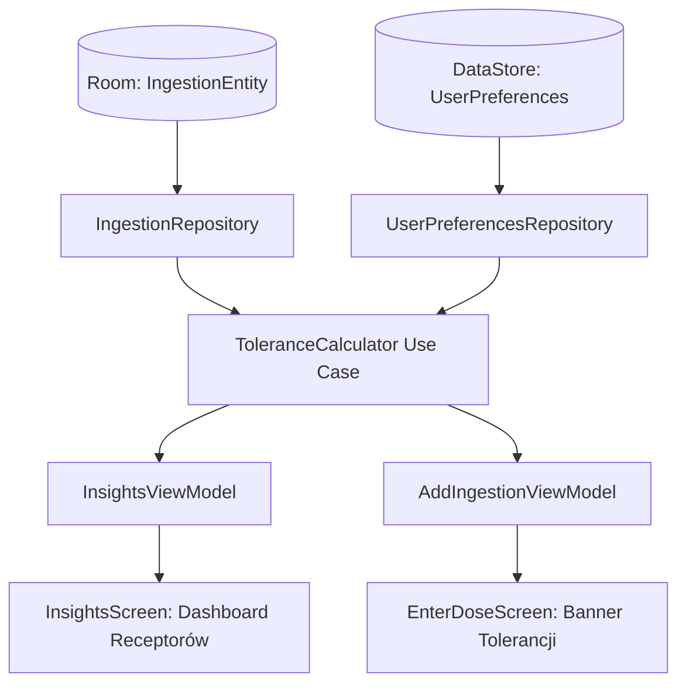

# Silnik Tolerancji Receptorowej i Bezpiecznych Odstępów (Tolerance & Reset Engine) - Specyfikacja Projektowa

Data utworzenia: 2026-09-18  
Status: Zatwierdzony do implementacji  
Projekt: Hyperreal Journal (Android, Kotlin, Jetpack Compose, Room, Hilt, DataStore)

---

## 1. Cel i Kontekst Biznesowy (Harm Reduction)

Aplikacja *Hyperreal Journal* służy do bezpiecznego rejestrowania zażywania substancji psychoaktywnych (Harm Reduction). Jednym z najczęstszych powodów przedawkowań oraz marnowania substancji jest nieświadomość **tolerancji receptorowej** oraz zjawiska **tolerancji krzyżowej (cross-tolerance)**:
- Użytkownicy psychodelików (np. LSD, Psylocybina) po zażyciu dawki często próbują powtórzyć doświadczenie po 1-3 dniach, co wymagałoby podwojenia dawki i grozi nieprzewidywalnymi reakcjami oraz znacznym obciążeniem psychicznym.
- Użytkownicy MDMA (entaktogenów) często nie przestrzegają reguły 3 miesięcy (90 dni), ryzykując uszkodzenie aksonów serotoninergicznych (SERT) i depresję poinwazyjną ("mid-week blues").
- Użytkownicy opioidów i leków sedatywnych (benzodiazepiny, alkohol) wchodzą w ciągi wielodniowe, nie monitorując ryzyka fizycznego uzależnienia i tolerancji na depresję oddechową.

Celem niniejszego modułu jest wdrożenie w pełni autonomicznego, działającego 100% offline **Silnika Tolerancji i Resetu Receptorowego** (`ToleranceCalculator` / `ToleranceEngine`), który analizuje historię zażyć z bazy Room, mapuje substancje na układy receptorowe, oblicza precyzyjne krzywe regeneracji i ostrzega użytkownika zarówno na dedykowanym pulpicie w `InsightsScreen`, jak i kontekstowo podczas wpisywania dawki w `EnterDoseScreen`.

---

## 2. Model Farmakologiczny i Układy Receptorowe

Silnik grupuje substancje psychoaktywne w 5 kluczowych domen receptorowych (`ReceptorGroup`):

### 2.1. `SEROTONIN_2A` (Psychodeliki 5-HT2A)
- **Przedstawiciele:** LSD, Grzyby psylocybinowe (Psylocybina/Psylocyna), DMT, Meskalina, 2C-B, 2C-E itp.
- **Tolerancja krzyżowa:** Zażycie jakiegokolwiek agonisty 5-HT2A wywołuje natychmiastowe obniżenie wrażliwości receptora na wszystkie pozostałe.
- **Krzywa regeneracji:** 14-dniowy model wykładniczy:
  $$M(d) = 1.0 + 1.8 \times e^{-0.35 \times d} \quad (dla\ d < 14)$$
  - Dzień 0 (zaraz po zażyciu): $M \approx 2.80$ (potrzeba 280% dawki, tolerancja 100%, reset 0%).
  - Dzień 1: $M \approx 2.27$ (reset ~29%).
  - Dzień 3: $M \approx 1.63$ (reset ~65%).
  - Dzień 7: $M \approx 1.15$ (reset ~91%).
  - Dzień 14: $M = 1.00$ (reset 100%, brak tolerancji).

### 2.2. `MDMA_SERT` (Entaktogeny i uwalniacze monoamin)
- **Przedstawiciele:** MDMA, MDA, 5-MAPB, 6-APB.
- **Model regeneracji:** Reguła 90 dni (3 miesiące) niezbędna do odtworzenia zasobów neuroprzekaźników i gęstości transporterów SERT.
  - $0 - 29$ dni: Ryzyko **DANGER** (czerwony) — wysokie ryzyko neurotoksyczności i zespołu serotoninowego przy ponownym zażyciu.
  - $30 - 89$ dni: Ryzyko **WARNING** (żółty) — częściowa regeneracja, ale odstęp suboptymalny.
  - $\ge 90$ dni: Ryzyko **SAFE** (zielony) — zresetowany układ, optymalny stan harm reduction.

### 2.3. `DISSOCIATIVE_NMDA` (Dysocjanty i antagoniści NMDA)
- **Przedstawiciele:** Ketamina, Esketamina, DXM, Metoksetamina (MXE), PCP.
- **Model regeneracji:** Okno 14-28 dni.
- **Charakterystyka:** Tolerancja na dysocjanty narasta powoli, ale charakteryzuje się tzw. *perma-tolerance* (długotrwałym utrzymywaniem się przy częstym dawkowaniu).

### 2.4. `OPIOID_MOR` (Agoniści receptorów opioidowych Mu)
- **Przedstawiciele:** Morfina, Oksykodon, Kodeina, Fentanyl, Metadon, Buprenorfina, Tramadol.
- **Model monitorowania:** Detekcja ciągów (liczba kolejnych dni z zażyciem).
  - 1 dzień: **SAFE** (sporadyczne użycie).
  - 2 kolejne dni: **NOTICE** (wzrost tolerancji, początek nawyku).
  - $\ge 3$ kolejne dni: **DANGER** (poważne ryzyko uzależnienia fizycznego, tolerancji i objawów odstawiennych).

### 2.5. `GABA_SEDATIVE` (Modulatory allosteryczne GABA-A / Depresanty)
- **Przedstawiciele:** Benzodiazepiny (Alprazolam, Diazepam, Klonazepam itp.), Alkohol.
- **Model monitorowania:** Detekcja ciągów wielodniowych oraz minimalny odstęp regeneracyjny (min. 7-14 dni).

---

## 3. Architektura i Przepływ Danych (Clean Architecture)

### 3.1. Klasy Domenowe (`domain/model/`)
- `ReceptorGroup` (enum): `SEROTONIN_2A`, `MDMA_SERT`, `DISSOCIATIVE_NMDA`, `OPIOID_MOR`, `GABA_SEDATIVE`.
- `ToleranceRiskLevel` (enum): `SAFE`, `NOTICE`, `WARNING`, `DANGER`.
- `ToleranceStatus` (data class):
  - `group: ReceptorGroup`
  - `lastIngestionTime: Long?`
  - `daysSinceLast: Float?`
  - `resetProgressPercent: Int` (0 do 100)
  - `estimatedDoseMultiplier: Float?` (dla 5-HT2A)
  - `riskLevel: ToleranceRiskLevel`
  - `statusLabel: String`
  - `consecutiveDays: Int`
  - `harmReductionAdvice: String`

### 3.2. Use Case: `ToleranceCalculator`
- Metody:
  - `calculateAll(ingestions: List<Ingestion>, manualOverrides: Map<ReceptorGroup, Long>, currentTimeMs: Long): Map<ReceptorGroup, ToleranceStatus>`
  - `getStatusForSubstance(substanceId: String, ingestions: List<Ingestion>, manualOverrides: Map<ReceptorGroup, Long>, currentTimeMs: Long): ToleranceStatus?`
  - `mapSubstanceToGroup(substanceId: String): ReceptorGroup?`

### 3.3. Warstwa Danych (`data/local/datastore/`)
- Dodanie obsługi kluczy `tolerance_override_<group>` w `UserPreferencesRepository`.
- Metody: `setToleranceOverride(group: ReceptorGroup, timestamp: Long)`, `clearToleranceOverride(group: ReceptorGroup)`.
- Eksport `val toleranceOverridesFlow: Flow<Map<ReceptorGroup, Long>>`.

---

## 4. Interfejs Użytkownika (Jetpack Compose)

### 4.1. `InsightsScreen` (Sekcja "Stan Receptorów i Regeneracja")
- Umiejscowienie: powyżej ogólnego podziału substancji.
- Komponent `ReceptorRecoveryCard`:
  - Nazwa grupy i ikona.
  - Pasek postępu `LinearProgressIndicator` (kolorowany w zależności od `riskLevel`).
  - Etykieta: dni od zażycia, % resetu, mnożnik dawki lub ciąg dni.
  - Przycisk z ołówkiem/kalendarzem: otwiera `DatePickerDialog` pozwalający ustawić datę ostatniego zażycia (zapis w DataStore).

### 4.2. `EnterDoseScreen` (Harm Reduction Alert)
- Komponent `ToleranceWarningCard`:
  - Jeśli użytkownik wybrał substancję powiązaną z `ReceptorGroup`, a reset $< 100\%$ lub wykryto ciąg:
  - Wyświetla ostrzeżenie o tolerancji i mnożniku dawki wraz z poradą harm reduction.

---

## 5. Przypadki Brzegowe i Bezpieczeństwo
1. **Brak zażyć i brak daty ręcznej:** Stan `SAFE`, 100% resetu, komunikat o stanie bazowym.
2. **Data w przyszłości (błędny czas urządzenia):** Zabezpieczenie `coerceAtLeast(0f)`.
3. **Data ręczna vs baza Room:** Silnik wybiera $\max(\text{timestamp bazy}, \text{timestamp ręczny})$.
4. **Wiele dawek w ciągu jednej doby:** Zliczanie po unikalnych dniach kalendarzowych dla ciągów.
5. **Tolerancja krzyżowa:** Pełne mapowanie analogów (np. 1P-LSD $\to$ 5-HT2A, Psylocybina $\to$ 5-HT2A).

---

## 6. Plan Testów (TDD & Regresja)
- `ToleranceCalculatorTest`:
  - Weryfikacja punktów krzywej 5-HT2A (dni 0, 1, 3, 7, 14).
  - Weryfikacja reguły 90 dni MDMA (dni 10, 45, 95).
  - Weryfikacja ciągów opioidów (1 dzień vs 3 kolejne dni).
  - Weryfikacja tolerancji krzyżowej między różnymi substancjami z tej samej grupy.
  - Weryfikacja priorytetu override z DataStore.
- **Gwarancja regresji:** Wszystkie istniejące 65 testów jednostkowych muszą przejść bez błędów.
